# 게시판 만들기
## 목표
- Back-End 에 대한 이해
- 웹의 가장 기본인 게시판 구현해보기
- 등록, 읽기, 수정, 삭제, 파일업로드, 댓글처리, 로그인/로그아웃 기능 구현
## 개발 환경
- Eclipse
- Bootstrap 4
- Spring 5.0.7 & Maven 2.9
- JDK 1.8
- Oracle Database 11g Express Edition
- MyBatis 3.4.6
- Tomcat 9
## 개발 기간 - 2019/07/01 ~ 08/14
## 게시판 패키지 구조
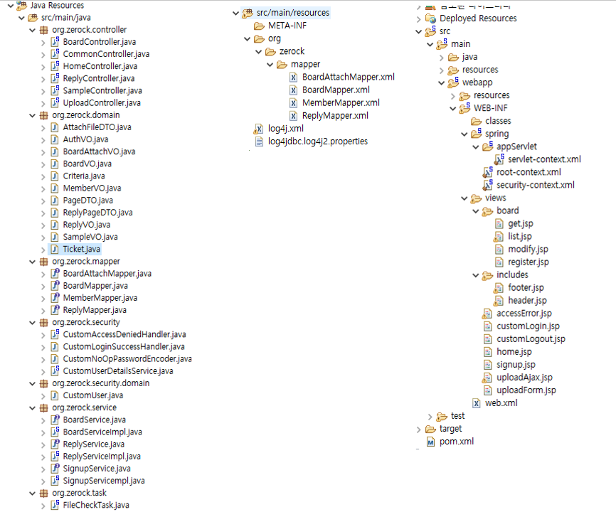
## 데이터베이스
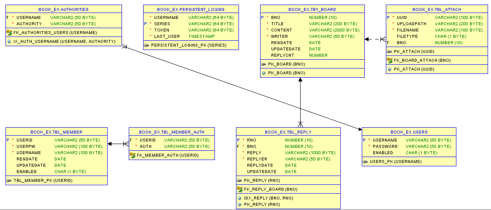
## 주요 기능
- 게시글 읽기
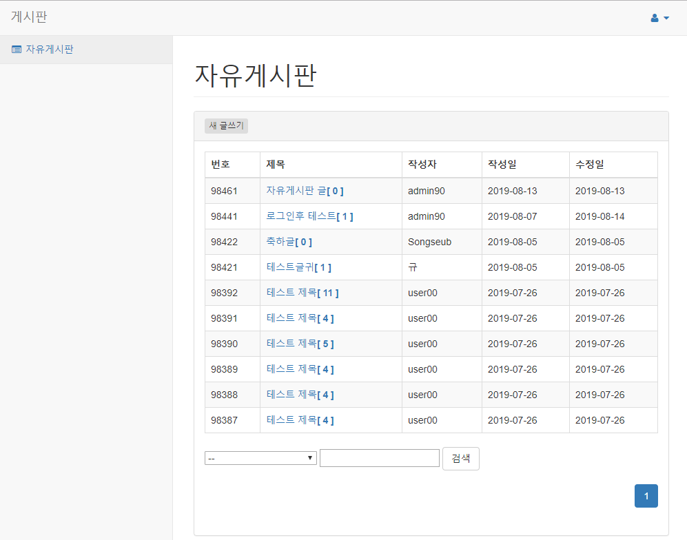
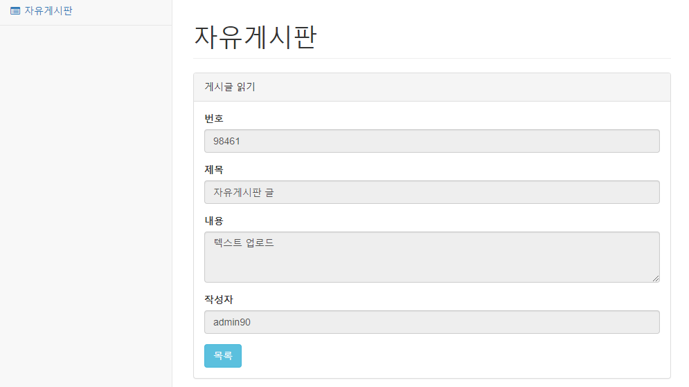

- 검색
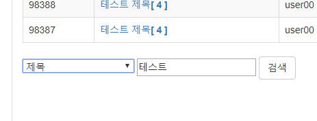
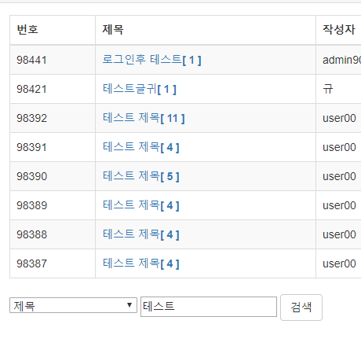

- 게시글 목록 페이지 처리
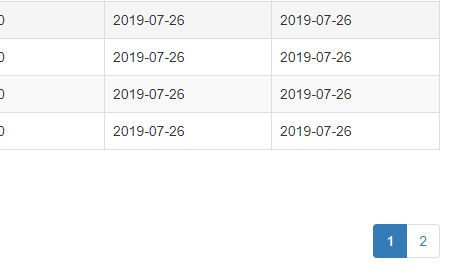

- 게시글 등록
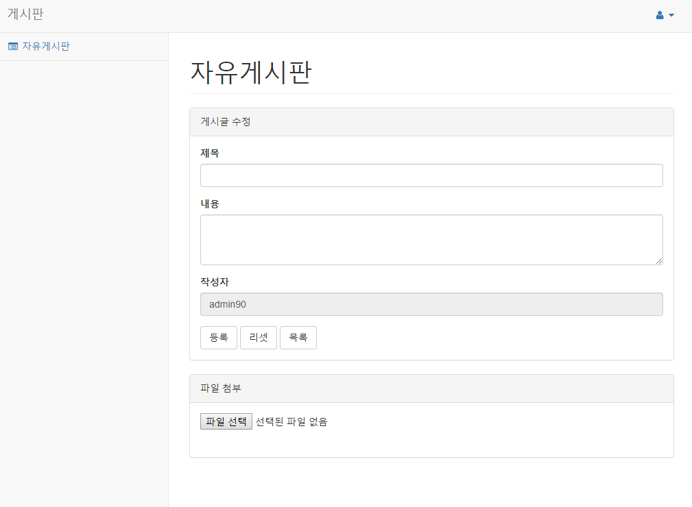

- 게시글 수정, 삭제
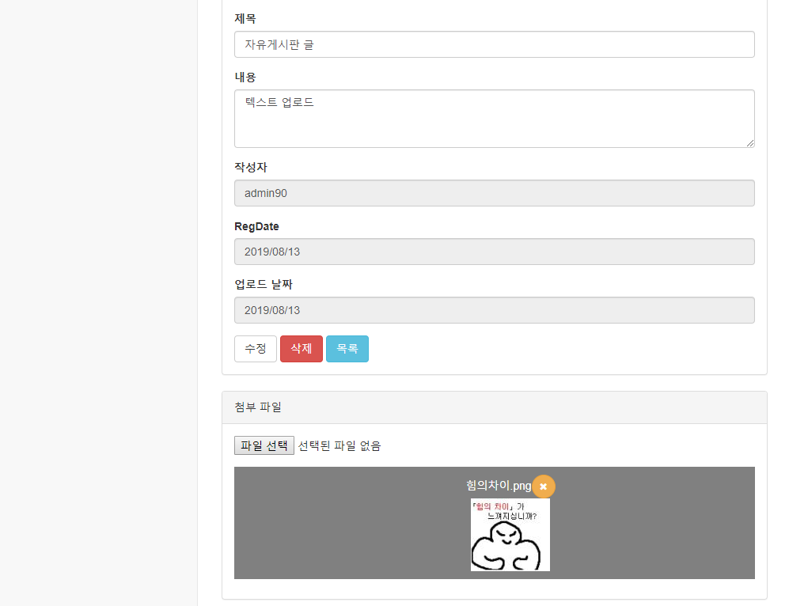

- 파일 업로드
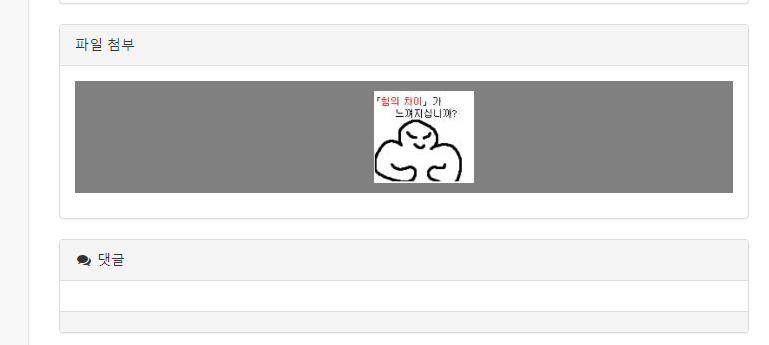

- 게시글 댓글, 댓글 수정, 댓글 페이지 처리
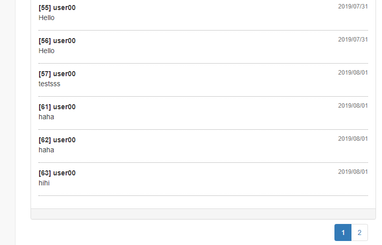
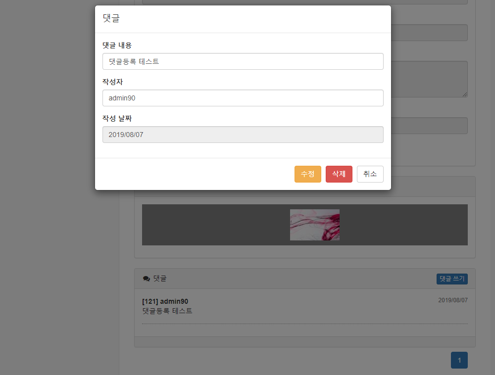
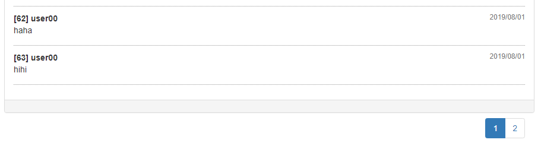

- 로그인 / 로그아웃
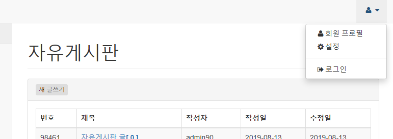
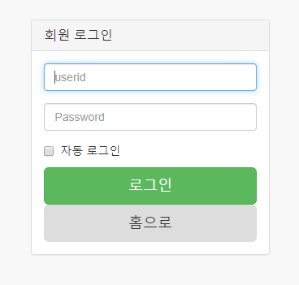
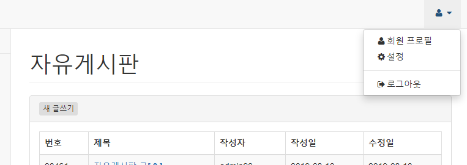
